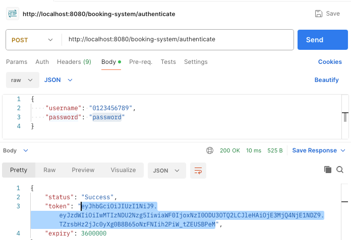
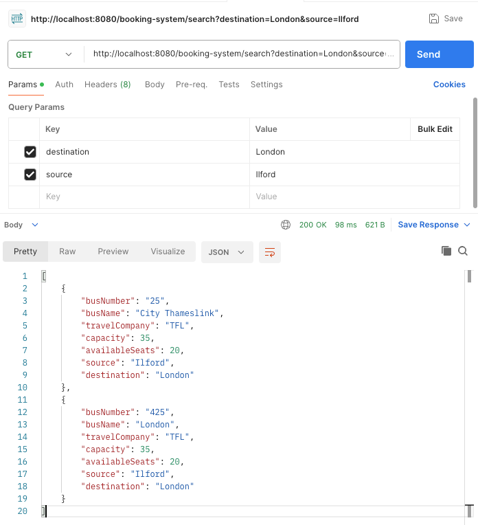
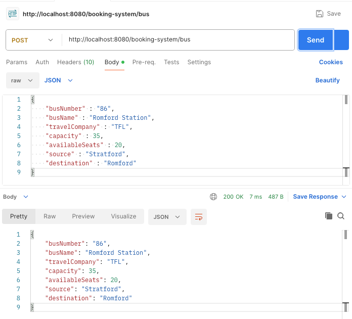
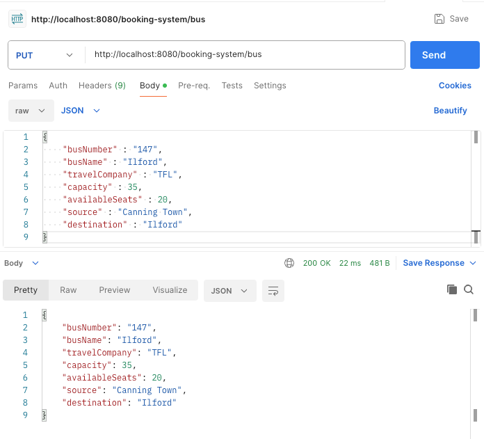
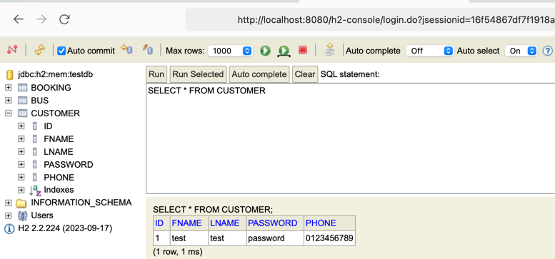
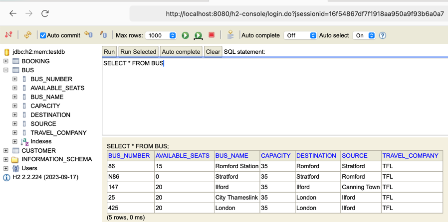

# Bus Booking System - Documentation with Screenshots

## Overview
This document provides a visual guide to the Bus Booking System, including screenshots of Postman requests and the database tables.

## Postman Requests

### 1. **Authenticate**
- **Endpoint**: `POST /booking-system/authenticate`
- **Description**: This request allows a user to authenticate by providing a phone number and password.
- **Request Body**:
    ```json
    {
      "phone": "1234567890",
      "password": "password"
    }
    ```
- **Screenshot**:

  
  

### 2. **Get All Buses**
- **Endpoint**: `GET /booking-system/bus`
- **Description**: Retrieves a list of all available buses.
- **Screenshot**:

  

### 3. **Search Buses**
- **Endpoint**: `GET /booking-system/search`
- **Description**: Retrieves a list of all available buses between a source and destination.
- **Screenshot**:

  

### 4. **Add a New Bus**
- **Endpoint**: `POST /booking-system/bus`
- **Description**: Adds a new bus to the system.
- **Request Body**:
    ```json
    {
      "bus_number": "BUS123",
      "bus_name": "Express",
      "travel_company": "Fast Travels",
      "capacity": 50,
      "available_seats": 50,
      "source": "City A",
      "destination": "City B"
    }
    ```
- **Screenshot**:

  
  
  

### 4. **Book a Seat**
- **Endpoint**: `POST /booking-system/book`
- **Description**: Books a seat on a selected bus.
- **Request Body**:
    ```json
    {
      "bus_number": "BUS123",
      "booking_date": "2024-08-19",
      "source": "City A",
      "destination": "City B",
      "total_seats": 2
    }
    ```
- **Screenshot**:

  
  

## Database Table Screenshots

### 1. **Customers Table**
- **Description**: This table stores all user details including phone number, name, and password.
- **Screenshot**:

  

### 2. **Buses Table**
- **Description**: This table contains all bus information, such as bus number, name, travel company, capacity, and route details.
- **Screenshot**:

  

### 3. **Bookings Table**
- **Description**: This table records all the bookings made by users, including bus number, booking date, source, destination, and seat details.
- **Screenshot**:

  
