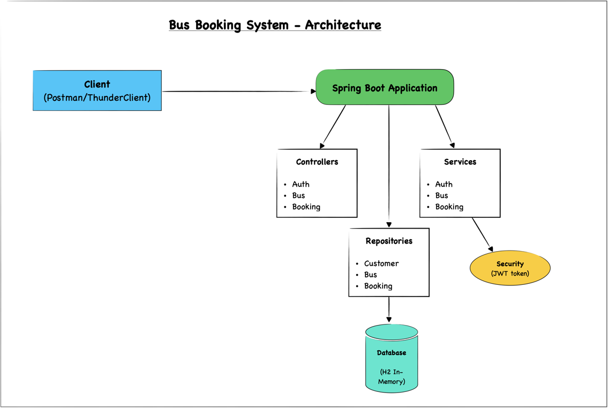
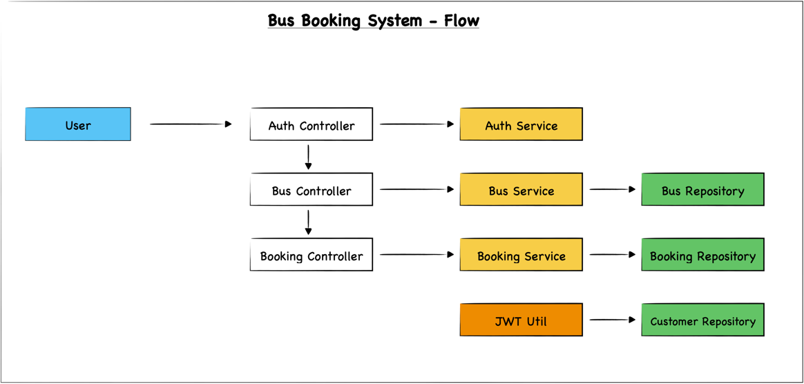

# Bus-Booking-System
## Overview
The Bus Booking System is a simple backend application built using **Kotlin**, **Spring Boot**, and **H2 in-memory database**. It allows users to authenticate, search for buses, and book seats. The system also provides an administrative interface for managing bus details.

## Features
- **User Authentication**: Users can log in with a phone number and password to receive a JWT token.
- **Bus Management**: Administrators can add, update, and view bus details.
- **Bus Search**: Users can search for buses based on the source and destination.
- **Bus Booking**: Users can book available seats on buses.

## Tech Stack
- **Kotlin**: Programming language used for developing the backend.
- **Spring Boot**: Framework for building the RESTful API and managing business logic.
- **H2 Database**: In-memory database used for storing user, bus, and booking information.
- **JWT (JSON Web Token)**: Used for securing API endpoints.

### Architecture Diagram
- Client (Postman/Thunder Client) interacts with the Spring Boot Application through REST APIs.
- The application consists of Controllers, Services, Repositories, and a Security Component (JWT).
- All data is stored in an H2 In-Memory Database.



### Flow Diagram
- The flow starts with the User interacting with the Auth Controller for authentication, which forwards requests to the
  Auth Service and then to the JWT Util for token generation.
- The Bus Controller and Booking Controller handle bus-related and booking-related operations, respectively,
  communicating with their respective services and repositories.

  

### Project Structure
```css
bus-booking-system/
│
├── src/main/kotlin/com/hm/bookingsystem/
│    ├── BookingSystemApplication.kt
│    ├── GlobalExceptionHandler.kt
│    ├── ServletInitializer.kt
│    ├── controller/
│    │    ├── AuthController.kt
│    │    ├── BusController.kt
│    │    └── BookingController.kt
│    ├── model/
│    │    ├── Authentication.kt
│    │    ├── Customer.kt
│    │    ├── ErrorResponse.kt
│    │    ├── Bus.kt
│    │    └── Booking.kt
│    ├── repository/
│    │    ├── CustomerRepository.kt
│    │    ├── BusRepository.kt
│    │    └── BookingRepository.kt
│    ├── service/
│    │    ├── AuthService.kt
│    │    ├── BusService.kt
│    │    └── BookingService.kt
│    └── security/
│         └── JwtUtil.kt
├── src/main/resources/
│    ├── application.properties
└── build.gradle.kts
```

## Endpoints

### **Authentication**
- **POST /booking-system/authenticate**
  - **Request Body**:
    ```json
    {
      "phone": "string",
      "password": "string"
    }
    ```
  - **Response**:
    ```json
    {
      "token": "jwt-token",
      "status": "api-status"
    }
    ```

### **Bus Management (Admin)**
- **GET /booking-system/bus**
  - Retrieves all buses.

- **POST /booking-system/bus**
  - Adds a new bus.
  - **Request Body**:
    ```json
    {
      "bus_number": "string",
      "bus_name": "string",
      "travel_company": "string",
      "capacity": number,
      "available_seats": number,
      "source": "string",
      "destination": "string"
    }
    ```

- **PUT /booking-system/bus**
  - Updates bus details.
  - **Request Body**: Same as POST.

### **Bus Search**
- **GET /booking-system/search**
  - Searches for buses between a source and destination.
  - **Query Parameters**:
    - `source`: Source location.
    - `destination`: Destination location.

### **Booking**
- **POST /booking-system/book**
  - Books seats on a bus.
  - **Request Body**:
    ```json
    {
      "bus_number": "string",
      "booking_date": "string",
      "source": "string",
      "destination": "string",
      "total_seats": number
    }
    ```

## Security
- **JWT (JSON Web Token)** is used to secure the API endpoints. Only authenticated users can access certain endpoints.
- The token is required for all bus search and booking operations.

## Database
The system uses an **H2 in-memory database** to store information about:
- **Customers**: User details (ID, phone number, first name, last name, password).
- **Buses**: Details of the buses (bus number, name, travel company, capacity, available seats, source, destination).
- **Bookings**: Records of all bookings made by users (booking number, bus number, booking date, source, destination, total seats, booking status).

## Running the Application

### Prerequisites
- **Java 17** installed
- **IntelliJ IDEA** installed

### Steps
1. Clone the repository:
   ```bash
   git clone https://github.com/mghisham/bus-booking-system.git
   ```
2. Navigate to the project directory:
   ```bash
   cd bus-booking-system
   ```
3. Build the project using Gradle:
   ```bash
   ./gradlew clean 
   ./gradlew build 
   ```
4. Run the Spring Boot application:
   ```bash
   ./gradlew bootRun 
   ```
5. The application will start on http://localhost:8080.
6. The application database can be viewed on http://localhost:8080/h2-console/

### Testing the Application
You can use **Postman** or **Thunder Client** to send HTTP requests to the API endpoints.

## Documentations
- [Bus Booking System - Documentation with Screenshots](Documentation.md)
- [Reference Documentation](HELP.md)